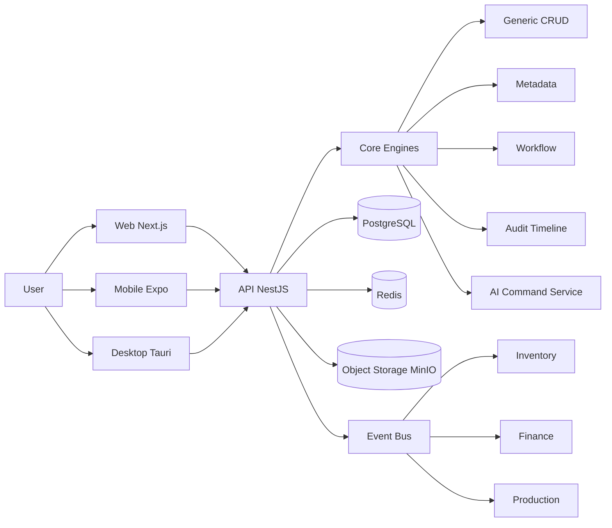

# OneERP

[Chinese](./README.md) | [English](./README.en.md)

OneERP is an AI-native ERP for manufacturing and supply-chain teams. It connects sales, purchasing, inventory, production, finance, permissions, audit trails, and AI-assisted analysis in one TypeScript stack.

The project is real and buildable, but it should not be presented as customer-ready production software yet. The current target is controlled internal trials and recoverable single-machine production rehearsal. Real inventory or finance usage must pass the production readiness gate.

## Why OneERP

OneERP is not just another admin dashboard with many forms. The goal is a business engine where operational actions and financial consequences can be verified together.

- Real business closure: sales orders, stock movements, journal entries, trial balance, user permissions, and audit records are designed to cross-check each other.
- Metadata-driven UI: common business objects can render list, kanban, form, workflow, and audit views from schema and metadata.
- Event-driven integration: inventory, finance, workflow, and AI features are connected through events instead of hard-coded page logic.
- Production rehearsal first: Docker Compose deployment, backup scripts, restore drills, smoke checks, and go-live checklists are part of the repository.
- Controlled AI: AI starts with read-only analysis and draft assistance. Write operations are disabled by default and must pass action-level permissions and audit controls.

## Who It Is For

- Manufacturing teams moving beyond spreadsheets, paper ledgers, or small inventory tools.
- Teams that need sales, stock, finance, roles, and auditability connected before adding more modules.
- Developers who want a TypeScript ERP foundation that can be self-hosted and customized.
- Operators who need a simple deployment path without ignoring backup, restore, and access-control requirements.

## Current Trial Capabilities

- Local and single-machine deployment through `scripts/quickstart.*`, `docker-compose.easy.yml`, and `docker-compose.ha-lite.yml`.
- Image-based production deployment through `docker-compose.prod.yml` and the GitHub `Deploy` workflow.
- Decimal migration for core financial and inventory quantities.
- Access token and refresh token authentication, login lockout, and password policy.
- Backend-driven sales order pricing and dedicated order APIs.
- Inventory ledger pagination, shipment allocation, and partial shipment status.
- Employee invitation, role permissions, read-only staff checks, and AI write protection.
- Production readiness docs for backup, restore drills, smoke checks, and go-live approval.

## Comparison

| Area | OneERP | Odoo | ERPNext |
| --- | --- | --- | --- |
| Stack | TypeScript, NestJS, Next.js, Prisma | Python and JavaScript | Python and JavaScript |
| Core model | Metadata-driven CRUD, workflow, events | Modular ORM | DocType-based modules |
| AI | Built-in command bar, Chat2Dash, Chat2SQL | Usually plugin based | Usually plugin based |
| Deployment target | Self-hosted, single-machine trial first | Broad hosting options | Broad hosting options |
| Customization path | Schema, metadata, API modules | Module customization | DocType and app customization |

## Screenshots

Real product screenshots are still pending. Before a public launch, add and manually review screenshots for:

- Dashboard overview
- Sales order workspace
- Inventory ledger and stock movements
- Finance vouchers, trial balance, or receivable/payable pages
- AI Command Bar or Chat2Dash read-only analysis

Until these screenshots are available, this repository should not be marketed as production-ready or used as a public customer landing page.

## Quickstart

Install dependencies:

```bash
npm install
```

Start the basic development services:

```bash
docker compose up -d
```

Initialize Prisma from the API app:

```bash
cd apps/api
npx prisma generate
npx prisma migrate dev --name init
cd ../..
```

Start the API:

```bash
cd apps/api
npm run start:dev
```

Start the Web app in another terminal:

```bash
cd apps/web
npm run dev
```

Default URLs:

- Web: http://localhost:3000
- API: http://localhost:8000/api
- Swagger: http://localhost:8000/api/docs

## One-Command Trial Deployment

Windows PowerShell:

```powershell
.\scripts\quickstart.ps1 -Rebuild
```

Linux or macOS:

```bash
sh scripts/quickstart.sh --rebuild
```

If `.env` does not exist, quickstart creates it and generates local secrets. If `.env` already exists, quickstart validates required values before Docker starts.

Read the deployment guide:

- [Quickstart Deployment](./docs/QUICKSTART_DEPLOY.md)
- [HA-lite Runbook](./docs/HA_LITE_RUNBOOK.md)
- [Production Readiness](./docs/PRODUCTION_READINESS.md)
- [Go-live Checklist](./docs/GO_LIVE_CHECKLIST.md)

## Production Readiness Gate

Do not load real inventory or finance data until the gate is complete.

Minimum required checks include:

- `npm run validate` passes on the exact release commit.
- `docker compose -f docker-compose.ha-lite.yml config` passes.
- If image deployment is used, `docker compose -f docker-compose.prod.yml config` passes with the production `.env`.
- `scripts/deploy-check.*`, `scripts/prod-smoke.*`, `scripts/staff-permission-smoke.*`, and `scripts/business-acceptance.*` pass.
- `scripts/audit-prod-config.*` reports no P0 issues.
- PostgreSQL and MinIO backups are configured and restore drill output is passing.
- Public access uses HTTPS.
- PostgreSQL, Redis, and MinIO ports are not exposed to the public internet.
- `CORS_ORIGINS` contains only trusted Web origins.
- Critical and high dependency vulnerabilities are fixed or explicitly accepted with a reason.

## Image-Based Deployment

The GitHub `Deploy` workflow publishes three images:

- `ghcr.io/<owner>/oneerp-api`
- `ghcr.io/<owner>/oneerp-api-migrate`
- `ghcr.io/<owner>/oneerp-web`

Remote deployment runs only when either:

- repository variable `DEPLOY_ENABLED=true` and the push is on `main`; or
- the workflow is started manually with `deploy` enabled.

Required deployment configuration:

- Secrets: `DEPLOY_HOST`, `DEPLOY_USER`, `DEPLOY_SSH_KEY`.
- Variables: `DEPLOY_PATH`, optionally `APP_URL`, optionally `GHCR_USERNAME`.
- Secret `GHCR_TOKEN` if the GHCR package is private.

The remote deployment directory must keep the production `.env`. The workflow syncs `docker-compose.prod.yml` from the release commit before running Docker Compose.

## Architecture



## Modules

- Auth and users
- Departments, company, and tenant context
- Orders, partners, products, and materials
- Inventory: warehouses, locations, quants, transactions
- Production: BOM, work orders, work reports
- Finance: invoices, payments, journals, entries, DLQ
- Files: object storage and download links
- Dashboard: operational views
- Core: CRUD, metadata, workflow, audit, AI

## AI Features

- AI Command Bar: natural-language business actions with dry-run draft confirmation.
- Chat2Dash: natural-language chart and dashboard insights.
- Chat2SQL: natural-language read-only query assistance.
- OCR Draft: planned attachment recognition and draft document generation.

## Roadmap

- [x] P0: Decimal precision for money and quantities, startup migrations, refresh tokens, password policy, login lockout.
- [x] P0: Employee invitations, action-level permissions, AI write operations disabled by default.
- [x] P0: Backend sales pricing, dedicated order APIs, inventory ledger pagination, partial shipment foundation.
- [ ] P0: Purchasing flow: purchase order, receiving, three-way match, accounts payable.
- [ ] P0: Manufacturing loop: BOM explosion, material issue, completion receipt, WIP.
- [ ] P1: Period close, general ledger, sub-ledgers, aging, export and print.
- [ ] P1: React Query, form validation, unified UI components, E2E tests.
- [ ] P2: Multi-currency, CRM, mobile barcode scanning, desktop printing.

## Contributing

1. Fork the repository.
2. Create a branch such as `agent/backend/*`, `agent/frontend/*`, or `agent/db/*`.
3. Use Conventional Commits.
4. Open a PR and pass CI.

See [CONTRIBUTING.md](./CONTRIBUTING.md) for more details.

## Documentation

- [RELEASES.md](./RELEASES.md)
- [Architecture Standards](./docs/architecture/STANDARDS.md)
- [Project Plan and Status](./docs/plans/PROJECT_PLAN_AND_STATUS.md)
- [AI Instructions](./docs/AI_INSTRUCTIONS.md)
- [Production Readiness](./docs/PRODUCTION_READINESS.md)
- [Go-live Checklist](./docs/GO_LIVE_CHECKLIST.md)

## License

MIT. See [LICENSE](./LICENSE).
