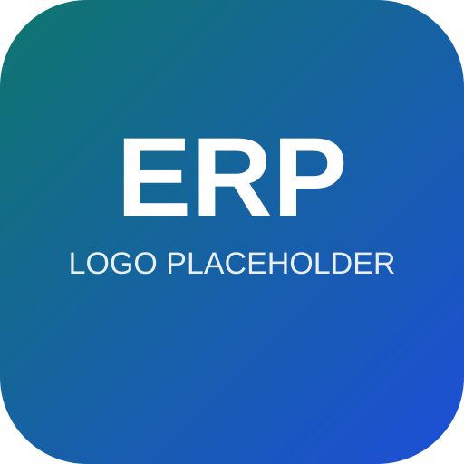
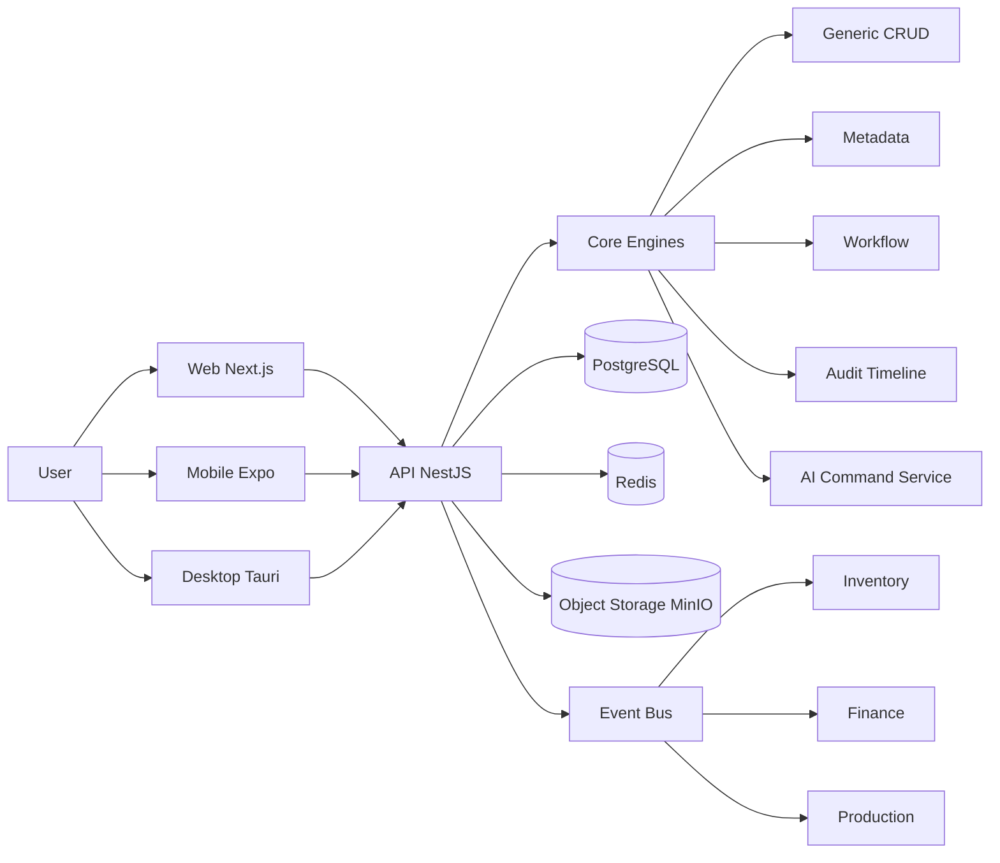

# Enterprise ERP

<p align="center">
	
</p>

<p align="center">
	<a href="#"></a>
	<a href="#"></a>
	<a href="#"></a>
	<a href="#"></a>
	<a href="#"></a>
</p>

一套面向制造与供应链场景的 AI Native ERP，主打元数据驱动、事件驱动和多端协同。

## Why This Project

本项目不是做一个“页面很多的管理后台”，而是做一个可持续演进的业务引擎：

- 元数据驱动 UI（减少重复开发）
- 通用 CRUD + 生命周期 Hook（业务扩展不破坏内核）
- 事件驱动跨模块联动（库存、财务、流程解耦）
- AI 命令栏 + Chat2Dash/Chat2SQL（从“点按钮”升级到“说意图”）

## 核心亮点对比

| 对比项 | Enterprise ERP | Odoo | ERPNext |
| --- | --- | --- | --- |
| 技术栈 | TypeScript 全栈（NestJS + Next.js） | Python + JS | Python + JS |
| 核心范式 | 元数据驱动 + 通用 CRUD + 事件驱动 | 模块化 + ORM | 模块化 + DocType |
| AI 原生能力 | 内置 Command Bar / Chat2Dash / Chat2SQL | 需要额外插件 | 需要额外插件 |
| 多端规划 | Web + Mobile(Expo) + Desktop(Tauri) | Web 为主 | Web 为主 |
| 自定义成本 | 中低（Schema + Metadata） | 中 | 中 |

## 功能截图（占位）

> 请把真实截图放到 `docs/image/screenshots/`，并替换以下占位链接。

- 仪表盘总览：`docs/image/screenshots/dashboard.png`
- 销售订单工作台：`docs/image/screenshots/sales-order.png`
- 库存台账：`docs/image/screenshots/inventory-ledger.png`
- AI 命令栏：`docs/image/screenshots/ai-command.png`

## 5 分钟快速启动

### 1) 安装依赖

```bash
npm install
```

### 2) 启动基础服务（Postgres/Redis）

```bash
docker compose up -d
```

### 3) 初始化数据库（在 API 子项目）

```bash
cd apps/api
npx prisma generate
npx prisma migrate dev --name init
cd ../..
```

### 4) 启动后端 API

```bash
cd apps/api
npm run start:dev
```

### 5) 启动前端 Web（新终端）

```bash
cd apps/web
npm run dev
```

访问地址：

- Web: http://localhost:3000
- API: http://localhost:8000/api
- Swagger: http://localhost:8000/api/docs

## 架构图



## 模块列表

- Auth / Users
- Departments / Company / Multi-tenant Context
- Orders / Partners / Product & Material
- Inventory（Warehouse / Location / Quant / Transactions）
- Production（BOM / WorkOrder / WorkReport）
- Finance（Invoice / Payment / Journal / Entry / DLQ）
- Files（对象存储与下载链接）
- Dashboard（运营看板）
- Core（CRUD / Metadata / Workflow / Audit / AI）

## AI 能力说明

- AI Command Bar：自然语言触发业务动作（支持 dry-run 草稿确认）
- Chat2Dash：自然语言转图表洞察
- Chat2SQL：自然语言转查询语句（只读场景）
- Document Draft：附件文件名解析生成发票草稿（LLM 降级为规则兜底）

## Roadmap

- [x] P0: 税务引擎（税码、税率、含税/未税）—— `TaxCode` 模型 + `finance.service.resolveTaxCode()` 已落地
- [ ] P0: 采购全链路（询价、采购单、收货、应付）
- [ ] P1: 库存单据头（Stock Picking/Wave）
- [ ] P1: 多币种与汇率重估
- [ ] P2: CRM 线索与商机漏斗
- [ ] P2: HR/Payroll

## Contributing

欢迎贡献代码、文档和测试：

1. 从 `develop` 新建任务分支（例如 `agent/api/purchase-order`、`agent/web/finance-page`、`agent/db/rbac-models`）
2. 单个 PR 只处理一个业务边界，避免多个 agent 同时修改 `schema.prisma`、`app.module.ts`、`ui-schema.ts`、`core/**` 或 lockfile
3. 提交前在根目录运行 `npm run validate`
4. 提交遵循 Conventional Commits
5. 功能 PR 合入 `develop`，稳定后由 `develop` 发版 PR 合入 `main`

详细规范见 [CONTRIBUTING.md](./CONTRIBUTING.md)。

## 文档入口

- [docs/architecture/ARCHITECTURE.md](./docs/architecture/ARCHITECTURE.md)
- [docs/README.md](./docs/README.md)
- [AGENTS.md](./AGENTS.md)
- [docs/architecture/STANDARDS.md](./docs/architecture/STANDARDS.md)
- [docs/architecture/DEVELOPMENT_WORKFLOW.md](./docs/architecture/DEVELOPMENT_WORKFLOW.md)
- [docs/architecture/QUALITY_GATES.md](./docs/architecture/QUALITY_GATES.md)
- [docs/runbooks/README.md](./docs/runbooks/README.md)
- [docs/plans/PROJECT_PLAN_AND_STATUS.md](./docs/plans/PROJECT_PLAN_AND_STATUS.md)
- [docs/plans/CORE_MODULES_DEV_PLAN.md](./docs/plans/CORE_MODULES_DEV_PLAN.md)
- [docs/AI_INSTRUCTIONS.md](./docs/AI_INSTRUCTIONS.md)

## License

MIT
