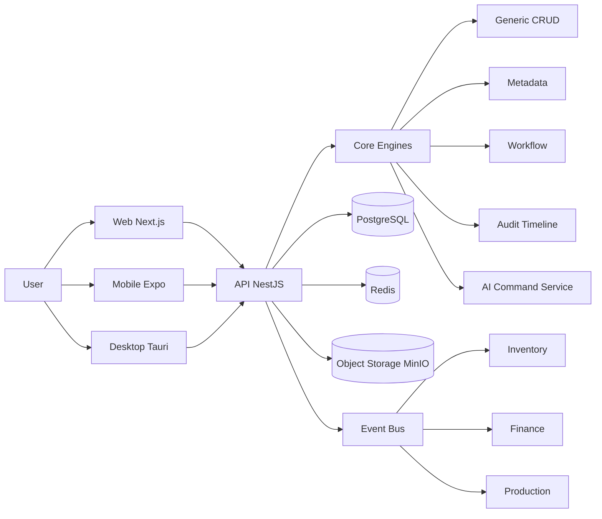

# OneERP

[中文](./README.md) | [English](./README.en.md)

<p align="center">
	
</p>

<p align="center">
	<a href="#"></a>
	<a href="#"></a>
	<a href="#"></a>
	<a href="#"></a>
	<a href="#"></a>
</p>

**OneERP 是面向制造与供应链企业的 AI Native ERP。**

它不是一个只做表格录入的管理后台，而是把销售、采购、库存、生产、财务、权限、审计和 AI 助手放进同一套可演进业务引擎里。当前目标是先做到“单机增强 + 可恢复生产试运行”：小团队也能快速部署，真实库存和财务数据有备份、有验收、有权限边界。

English summary: OneERP is an AI-native ERP for manufacturing and supply-chain teams, built around real inventory, financial reliability, permission governance, auditability, and simple single-machine production deployment.

## Why This Project

本项目不是做一个“页面很多的管理后台”，而是做一个可持续演进的业务引擎：

- **真实业务闭环**：销售订单、库存出入库、财务过账、试算平衡、员工权限和审计日志互相校验，避免“页面能点、账实不通”。
- **元数据驱动 UI**：常见业务对象可由元数据渲染列表、看板、表单和动作，减少重复页面开发。
- **事件驱动联动**：库存、财务、流程通过事件解耦，便于后续扩展采购、生产、应收应付和 AI 助手。
- **生产试运行优先**：提供 Docker Compose 单机增强、15 分钟级备份策略、恢复演练脚本和上线清单。
- **AI 可控接入**：AI 先做只读分析和草稿辅助，写操作默认关闭，并受动作级权限与审计约束。

## 适合谁

- 正在从 Excel、手工台账或轻量进销存升级的制造企业。
- 需要把销售、库存、财务和权限先打通，再逐步引入采购、生产和 AI 的团队。
- 想要 TypeScript 全栈、可二次开发、可私有化部署 ERP 骨架的开发者。
- 希望“小白也能部署”，但又不想牺牲备份、恢复、审计和权限边界的项目负责人。

## 当前生产试运行能力

- 单机本地生产入口：`scripts/start-local-prod.ps1` 与 `docker-compose.ha-lite.yml`。
- 数据安全：核心金额/数量字段迁移为 Decimal，减少财务和库存浮点误差。
- 账号安全：Access Token + Refresh Token、登录失败锁定、强密码策略。
- 业务安全：订单价格由后端产品销售价决定，通用 CRUD 不能绕过订单专用接口。
- 库存可靠性：库存台账后端分页，销售发货支持多批次分配和部分发货状态。
- 权限治理：员工邀请、角色权限、只读员工受限操作、AI 写操作默认关闭。

## 核心亮点对比

| 对比项 | Enterprise ERP | Odoo | ERPNext |
| --- | --- | --- | --- |
| 技术栈 | TypeScript 全栈（NestJS + Next.js） | Python + JS | Python + JS |
| 核心范式 | 元数据驱动 + 通用 CRUD + 事件驱动 | 模块化 + ORM | 模块化 + DocType |
| AI 原生能力 | 内置 Command Bar / Chat2Dash / Chat2SQL | 需要额外插件 | 需要额外插件 |
| 多端规划 | Web + Mobile(Expo) + Desktop(Tauri) | Web 为主 | Web 为主 |
| 自定义成本 | 中低（Schema + Metadata） | 中 | 中 |

## 功能截图（占位）

> 请把真实截图放到 `docs/image/screenshots/`，并替换以下占位链接。

- 仪表盘总览：`docs/image/screenshots/dashboard.png`
- 销售订单工作台：`docs/image/screenshots/sales-order.png`
- 库存台账：`docs/image/screenshots/inventory-ledger.png`
- AI 命令栏：`docs/image/screenshots/ai-command.png`

## 5 分钟快速启动

### 1) 安装依赖

```bash
npm install
```

### 2) 启动基础服务（Postgres/Redis）

```bash
docker compose up -d
```

### 3) 初始化数据库（在 API 子项目）

```bash
cd apps/api
npx prisma generate
npx prisma migrate dev --name init
cd ../..
```

### 4) 启动后端 API

```bash
cd apps/api
npm run start:dev
```

### 5) 启动前端 Web（新终端）

```bash
cd apps/web
npm run dev
```

访问地址：

- Web: http://localhost:3000
- API: http://localhost:8000/api
- Swagger: http://localhost:8000/api/docs

## 单机一键部署

适合内测、试运行和生产演练：

```powershell
.\scripts\quickstart.ps1 -Rebuild
```

Linux/macOS:

```bash
sh scripts/quickstart.sh --rebuild
```

部署说明见 [docs/QUICKSTART_DEPLOY.md](./docs/QUICKSTART_DEPLOY.md)。
真实库存/财务生产试运行使用 `docker-compose.ha-lite.yml`，并必须完成
[docs/HA_LITE_RUNBOOK.md](./docs/HA_LITE_RUNBOOK.md)、
[docs/PRODUCTION_READINESS.md](./docs/PRODUCTION_READINESS.md) 和
[docs/GO_LIVE_CHECKLIST.md](./docs/GO_LIVE_CHECKLIST.md)。

## 架构图



## 模块列表

- Auth / Users
- Departments / Company / Multi-tenant Context
- Orders / Partners / Product & Material
- Inventory（Warehouse / Location / Quant / Transactions）
- Production（BOM / WorkOrder / WorkReport）
- Finance（Invoice / Payment / Journal / Entry / DLQ）
- Files（对象存储与下载链接）
- Dashboard（运营看板）
- Core（CRUD / Metadata / Workflow / Audit / AI）

## AI 能力说明

- AI Command Bar：自然语言触发业务动作（支持 dry-run 草稿确认）
- Chat2Dash：自然语言转图表洞察
- Chat2SQL：自然语言转查询语句（只读场景）
- OCR Draft（规划中）：附件识别并生成草稿单据

## Roadmap

- [x] P0: Decimal 金额/数量精度、启动迁移、Refresh Token、强密码与登录锁定。
- [x] P0: 员工邀请、动作级权限、AI 写操作默认关闭。
- [x] P0: 销售订单后端定价、订单专用接口、库存台账分页、部分发货基础能力。
- [ ] P0: 采购全链路（采购单、收货、三单匹配、应付）。
- [ ] P0: 生产制造闭环（BOM 展开、领料、完工入库、WIP）。
- [ ] P1: 财务关账、总账/明细账、应收账龄、导出与打印。
- [ ] P1: React Query、表单校验、统一 UI 组件库和 E2E 测试。
- [ ] P2: 多币种、CRM、移动端扫码、桌面端打印。

## Contributing

欢迎贡献代码、文档和测试：

1. Fork 本仓库
2. 新建分支（`agent/backend/*`、`agent/frontend/*`、`agent/db/*`）
3. 提交遵循 Conventional Commits
4. 提交 PR 并通过 CI

详细规范见 [CONTRIBUTING.md](./CONTRIBUTING.md)。

## 文档入口

- [RELEASES.md](./RELEASES.md)
- [docs/architecture/STANDARDS.md](./docs/architecture/STANDARDS.md)
- [docs/plans/PROJECT_PLAN_AND_STATUS.md](./docs/plans/PROJECT_PLAN_AND_STATUS.md)
- [docs/plans/PROJECT_PLAN.md](./docs/plans/PROJECT_PLAN.md)
- [docs/plans/EXECUTION_PLAN.md](./docs/plans/EXECUTION_PLAN.md)
- [docs/plans/CORE_MODULES_DEV_PLAN.md](./docs/plans/CORE_MODULES_DEV_PLAN.md)
- [docs/AI_INSTRUCTIONS.md](./docs/AI_INSTRUCTIONS.md)

## License

本项目使用 MIT License，详见 [LICENSE](./LICENSE)。
