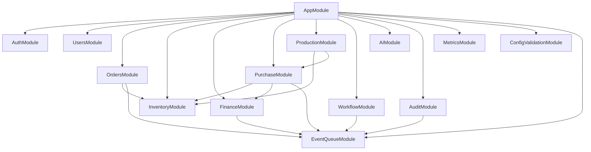

# OneERP 项目图谱与当前上下文

**生成时间**: 2026-07-04
**分支**: `refactor/remaining-tasks`
**来源**: 本地只读扫描。当前 Codex 环境未暴露 `graphify` 插件，因此本文件使用脚本扫描 `package.json`、Nest module/service、Web routes 和根脚本生成。

本文档用于压缩上下文，帮助后续迭代从当前代码和 PR 状态继续，而不是依赖长对话历史。

## 一、仓库分层

| 层 | 路径 | 角色 |
|----|------|------|
| Root | `package.json` | 聚合验证、审计、部署、备份、恢复、风险预检脚本 |
| API | `apps/api` | NestJS + Prisma + Kysely 后端，核心 ERP 业务、AI、审计、事件队列 |
| Web | `apps/web` | Next.js 工作台前端，订单、库存、采购、财务、AI、设置等页面 |
| Mobile | `apps/mobile` | Expo/React Native 移动端，仍有 moderate 级 Expo/uuid audit follow-up |
| Desktop | `apps/desktop` | 桌面端目录存在，但当前主线门禁主要覆盖 API/Web/Mobile audit |
| Ops | `scripts`、`.github/workflows`、`docker-compose*.yml` | 部署、备份恢复、冒烟、验收、CI/CD 与生产门禁 |

## 二、API 模块图谱

`apps/api/src/app.module.ts` 聚合 22 个模块、17 个 controller、34 个 service。主干关系：

关键原则：

- Controller 面向原 facade service，已提取的 query/report 子服务不直接暴露给 controller。
- Finance / Purchase / Inventory 的低风险只读查询基本已拆分，写流程暂不盲拆。
- 事务后业务事件通过 `EventQueueService` 发布，后续新增事件必须检查幂等键和重试语义。

## 三、核心服务热点

| Service | 行数 | 主要依赖 | 当前判断 |
|---------|------|----------|----------|
| `finance.service.ts` | 1734 | Prisma、EventQueue、FinanceReports、CustomerStatement、BankStatement、FinanceQuery | 仍含 9 个写操作和 `getReceivableAging`；下一步只做写流程分析，不直接拆 |
| `inventory.service.ts` | 1430 | Prisma、Kysely、EventQueue、StockQuery | 查询已进 StockQuery；下一步应优先强化 `executeStockMove`/冲销测试 |
| `metadata.service.ts` | 1191 | Prisma | 动态模型/字段核心服务，改动前需先确认模型约束 |
| `accounting.service.ts` | 1186 | Prisma、FinanceAccountMapping | 会计分录过账核心，需保持借贷平衡测试 |
| `ai.service.ts` | 1117 | Prisma、Crud、Metadata、Workflow、LLM、Orders | AI 读写边界敏感；写操作仍需权限和审计门禁 |
| `purchase.service.ts` | 902 | Prisma、Inventory、EventQueue、SupplierStatement、PurchaseQuery | 剩余 9 个写操作，优先分析 supplier payment / credit note |
| `orders.service.ts` | 830 | Prisma、EventQueue | 订单写流程和库存事件相关 |
| `production.service.ts` | 760 | Prisma、Inventory、Purchase | 生产补料、库存入账、采购联动 |

已完成拆分：

- `StockQueryService`
- `SupplierStatementService`
- `PurchaseQueryService`
- `purchase-order-read-model.ts`
- `CustomerStatementService`
- `BankStatementService`
- `FinanceQueryService`
- `FinanceReportsService`
- `finance.types.ts` / `inventory.types.ts`

## 四、Web 路由图谱

Next.js App Router 当前有 18 个页面/布局入口：

- `/`
- `/login`
- `/accept-invite`
- `/dashboard`
- `/dashboard/customers`
- `/dashboard/dynamic/[modelName]`
- `/dashboard/files`
- `/dashboard/finance`
- `/dashboard/inventory`
- `/dashboard/lab/data-grid`
- `/dashboard/orders`
- `/dashboard/orders/[id]`
- `/dashboard/production`
- `/dashboard/purchase`
- `/dashboard/sales`
- `/dashboard/settings`
- root layout + dashboard layout

后续前端重点不应继续堆页面逻辑，而应逐步抽：

- domain hooks
- workbench components
- 统一数据请求/缓存层
- 类型化 API client
- DataGrid/DynamicView 的列配置、保存视图、批量操作和虚拟滚动能力

## 五、门禁脚本图谱

根脚本中与上线直接相关的命令：

| 命令 | 作用 |
|------|------|
| `npm run validate` | Prisma validate/generate、API/Web typecheck、lint、test、build |
| `npm run audit:security` | Root/API/Web/Mobile high/critical 依赖审计门禁 |
| `npm run risk:preflight` | 剩余风险扫描 + enum dirty SQL 生成 |
| `npm run risk:preflight:db` | 在目标数据库上生成 enum dirty JSON 报告 |
| `npm run compose:config` | 校验 dev/easy/HA-lite/prod Compose，可阻断第三方 runtime `:latest` |
| `npm run prod:audit` | 生产 `.env` 审计，弱密钥/默认管理员/本地 CORS 为 P0 |
| `npm run deploy:check` | Docker/Compose/env/API/Web 部署健康检查 |
| `npm run prod:smoke` | 登录和核心 API/Web 冒烟 |
| `npm run business:acceptance` | 采购、库存、财务业务验收 |
| `npm run restore:drill` | 备份恢复演练 |

Deploy workflow 当前链路：

1. `release-preflight`: audit/security、migrate、risk preflight DB、compose config、validate。
2. 构建并推送 API / API migration / Web 镜像。
3. SSH 远端部署前校验变量格式。
4. 同步 `docker-compose.prod.yml`、`audit-prod-config.sh`、`deploy-check.sh`。
5. 远端 `.env` 生产审计。
6. `docker compose pull && docker compose up -d`。
7. 远端 `deploy-check.sh`。
8. workflow concurrency 串行化同一 ref 的部署。

## 六、当前 PR 状态

- PR: `https://github.com/cb8010d6/OneERP/pull/15`
- 状态: Draft
- 当前策略: 不声明生产就绪，不直接合并。
- 最近检查: commitlint、validate、CodeQL 均为 green。
- 本机 Docker daemon 不可用，因此仍缺真实容器启动与恢复演练证据。

## 七、下一步优先级

1. **真实环境门禁**：在可用 Docker/服务器上跑 HA-lite 或 prod compose、`deploy-check`、`prod-smoke`、`business-acceptance`、`restore-drill`。
2. **截图和 GitHub 门面**：补真实 Dashboard、订单、库存、采购、财务、AI 截图；补 GitHub About；保留“不宣称生产就绪”的措辞。
3. **写流程分析**：只读分析 Purchase supplier payment / supplier credit note 的事务、事件、幂等、失败回滚和测试覆盖。
4. **Inventory 引擎测试**：先增强 `executeStockMove`、冲销、循环部分成功的测试，再谈拆服务。
5. **T13 enum 独立分支**：目标库脏数据报告为 0 后，再按业务域做 Prisma enum migration。
6. **移动端依赖升级**：mobile 仍有 moderate Expo/uuid 链路告警，需单独升级验证，避免强行 `audit fix --force` 引入破坏性 Expo 变更。
